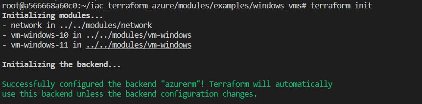
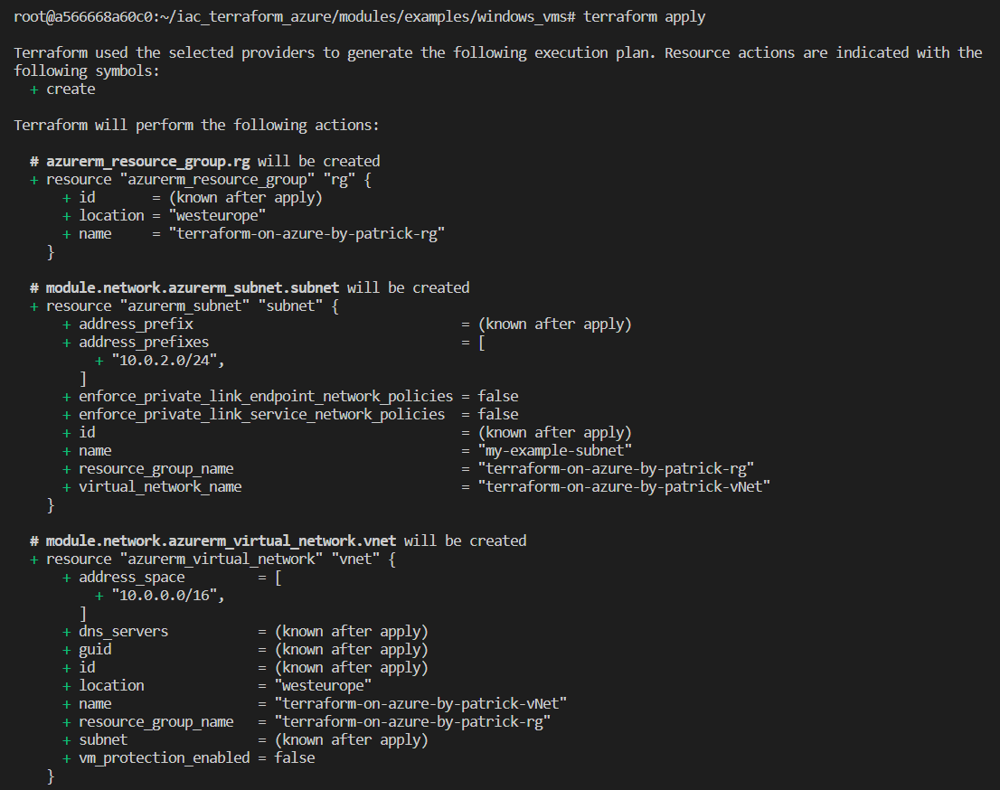
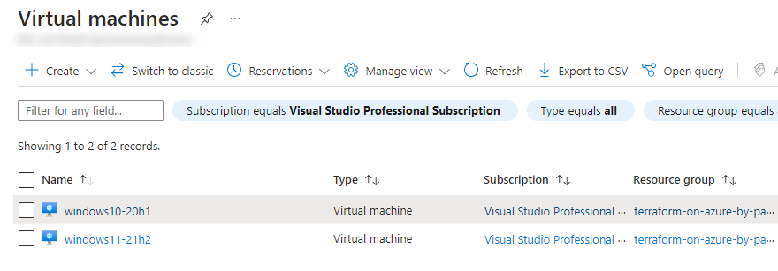

# 1. Introduction

This example is about deploying two Windows virtual machines on Azure, using Terraform modules.

For a more detailed manual please see the related blog post:

https://www.patrickkoch.dev/posts/post_30/

# 2. Prerequisites
 - [Azure CLI](https://learn.microsoft.com/en-us/cli/azure/install-azure-cli)
 - [Terraform](https://developer.hashicorp.com/terraform/downloads)
 - [Git (e.g.: for Windows)](https://gitforwindows.org/)


# 3. Preparing the environment

## 3.1 Login to your Azure Subscription with Azure CLI

First, log in to your Azure subscription by opening e.g.: a PowerShell prompt or opening a Terminal in Visual Studio Code and run:

```
az login
```
A browser session will be opened, enter the credentials for your account.
Ensure, that the desired subscription is properly set by applying:

``` powershell
az account show
```
In the output, you should see your subscription of choice. In my case, I'm using my Visual Studio subscription.

## Cloning the repository

Clone this repository by running the following git command:

``` powershell
git clone https://github.com/patkoch/iac_terraform_azure.git
```

## 4. Provisioning the virtual machines using modules

Conduct the initialization with the following command:

``` powershell
terraform init
```


This will establish a connection to the backend.
Conducting *terraform init* already indicates, that modules are used.

After that, run:

``` powershell
terraform validate
```

This takes care, that your files are formatted correctly. It will e.g. correct the shifting of your resource blocks.
If for example an adaption was made, then the command returns the name of the file, which was affected.

The final command for starting the deployment on Azure would be:

``` powershell
terraform apply
```


Verify after a few minutes that the virtual machines are deployed:



## 5. Destroy the resources

Use the following command to delete all provisioned resources again:

``` powershell
terraform destroy
```
