# 1. Introduction

This is intended for those, who would like to provision a Windows 11 Virtual Machine using Terraform.

# 2. Prerequisites
 - [Azure CLI](https://learn.microsoft.com/en-us/cli/azure/install-azure-cli)
 - [Terraform](https://developer.hashicorp.com/terraform/downloads)
 - [Git (for Windows)](https://gitforwindows.org/)

# 3. Preparing the environment

## 3.1 Login to your Azure Subscription with Azure CLI

First, log in to your Azure subscription by opening e.g.: a PowerShell prompt or opening a Terminal in Visual Studio Code and run:

``` powershell
az login
```

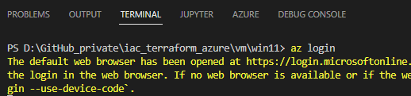

A browser session will be opened, enter the credentials for your account.
Ensure, that the desired subscription is properly set by applying:

``` powershell
az account show
```
In the output, you should see your subscription of choice. In my case, I'm using my Visual Studio subscription:

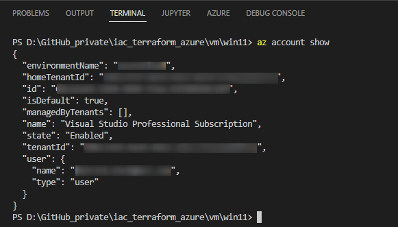

## Cloning the repository

Clone this repository by running the following git command:

``` powershell
git clone https://github.com/patkoch/iac_terraform_azure.git
```

After cloning it, switch to the directory "iac_terraform_azure/vm/win11"

# 4. Storing the Terraform state file in Azure

This configuration stores the Terraform state file in Azure - defined in the file "providers.tf" - by the following block:

``` terraform
  backend "azurerm" {
    resource_group_name  = "devopsexperiences-storage"
    storage_account_name = "alien39"
    container_name       = "terraformstate"
    key                  = "terraform.tfstate"
  }
```

This refers to a Storage Account (named "alien39"), including a Container that finally contains the Terraform state file.

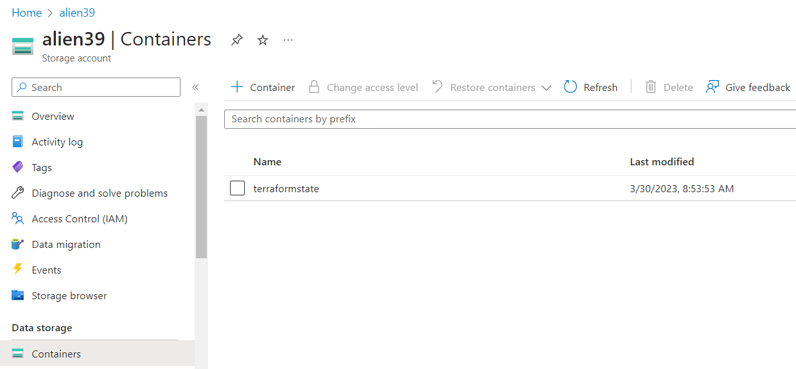

This means, that the Storage Account is mandatory for this configuration.

So, there are two options:

1. Create a Storage Account with a name of your choice (don't forget to update the block in "providers.tf"), including a container as storage for the Terraform state file 
2. Delete the block, shown in the snippet above, in that case, the Terraform state file won't get stored in Azure, but locally.


# 5. Provision, and remove the virtual machine with Terraform

Conduct the initialization with the following command:

``` powershell
terraform init
```
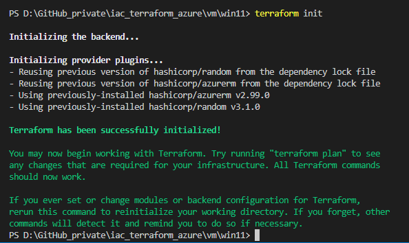

This will establish a connection to the backend.

After that, run:

``` powershell
terraform validate
```

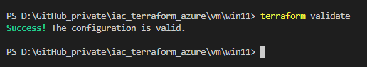

This validates the configuration file. The desired output can be seen in the picture above.

Make sure your Terraform configuration files are in the desired format, by using:

``` powershell
terraform fmt
```

This takes care, that your files are formatted correctly. It will e.g. correct the shifting of your resource blocks.
If for example an adaption was made, then the command returns the name of the file, which was affected.

E.g.:

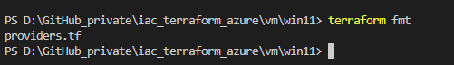

Create a Terraform plan by running:

``` powershell
terraform plan -out tfplan
```

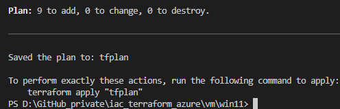

This creates the file "tfplan". If the resources are getting created for the very first time, then the final command for starting the provisioning would be:

``` powershell
terraform apply tfplan
```

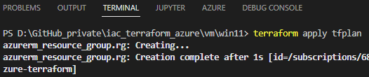

This provisions a Windows 11 virtual machine in your *Azure* subscription by adding 9 resources:

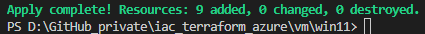

Finally, the virtual machine is ready to use and it is capable to be accessed with a remote desktop connection:

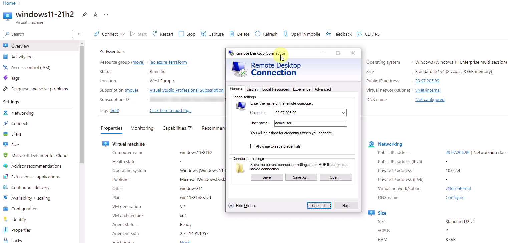

Note:
Assume, the resources are already created and you would run the following command a second time:

``` powershell
terraform plan -out tfplan
```

In that case you would get notified, that there are no changes, as seen in the picture below:

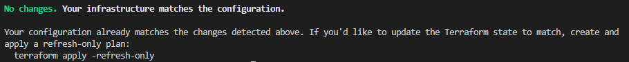

If you want to get rid of the virtual machine, including the additional resources like the public ip address, or the resource group, then use following command to remove them:

``` powershell
terraform destroy
```

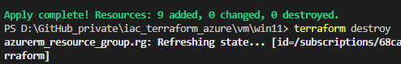

Confirm it, by typing "yes", to remove all created resources:

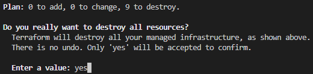

# 6. Run a Test using Terratest 

I've added a simple test, using *Terratest*, which verifies:
 * the resource group location
 * the resource group name
 * the name of the virtual machine
 * the public ip address

To conduct the test, change into the "test" directory and run following command:

``` powershell
 go test -v -run TestDeploymentVirtualMachine
```

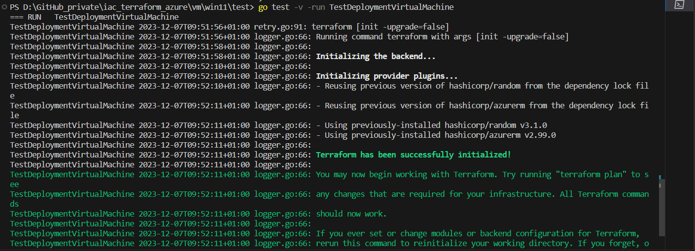

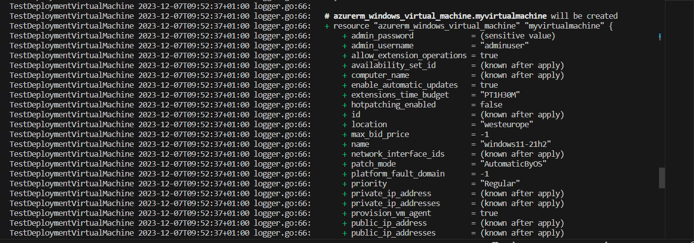

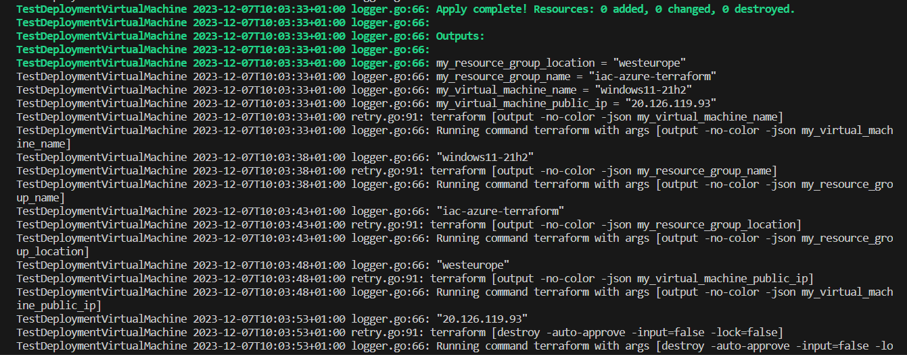

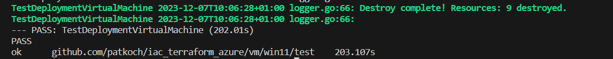


# References

[HashiCorp: Tutorials - Get Started - Azure](https://developer.hashicorp.com/terraform/tutorials/azure-get-started)
